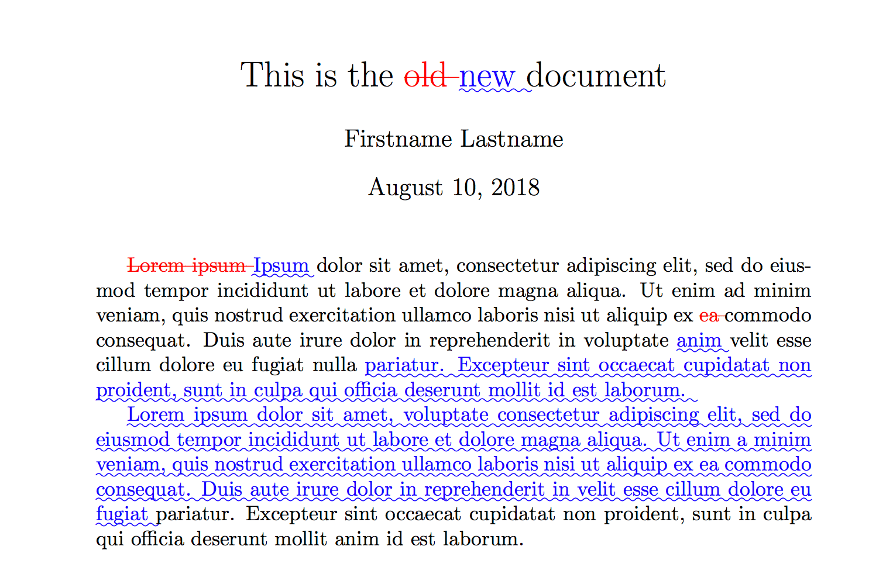

# LaTeXdiff via Docker with MikTeX

This guide describes how to use `latexdiff` inside the [`miktex/miktex`](https://hub.docker.com/r/miktex/miktex) Docker image to compare two LaTeX files. It addresses the issue of missing dependencies in the default MikTeX container, which runs with restricted privileges and does not allow installing Perl modules necessary for `latexdiff`.

<p align="center">
    
</p>

To overcome this, we run the container as `root` by overriding its entrypoint.

---

## 🗂 Step 0: Prepare Your Files

Ensure the two `.tex` files you want to compare are placed in a working directory. For example:

* `file_old.tex`
* `file_new.tex`

Then move to that directory:

```bash
cd /path/to/your/tex/files
```

---

## 🐳 Step 1: Run the MikTeX Docker Image as Root

By default, MikTeX runs as a low-privilege user. To install required dependencies for `latexdiff`, launch the container with elevated privileges:

```bash
sudo docker run -ti \
  -v miktex:/var/lib/miktex \
  -v "$(pwd)":/miktex/work \
  --user root \
  --entrypoint "" \
  miktex/miktex:basic bash
```

---

## 🛠 Step 2: Install Required Dependencies

Within the container, update the package list and install the necessary tools:

```bash
apt update
apt install build-essential
perl -MCPAN -e "install Algorithm::Diff"
```

---

## 📄 Step 3: Generate the Diff File

You can now use `latexdiff` to compare the two files:

```bash
latexdiff file_old.tex file_new.tex > diff.tex
```

This will produce a `diff.tex` file where:

* **Added text** is highlighted in **blue**
* **Removed text** is highlighted in **red**

---

## ✅ Notes

* The purpose of this guide is to bypass the missing `Algorithm::Diff` dependency in the MikTeX container. Since the container runs with insufficient privileges, we override the default entrypoint to gain `root` access and install the necessary packages.
* To **only show added text in blue** and **suppress deleted text**, use the following command instead:

  ```bash
  latexdiff -t CTRADITIONAL --no-del file_old.tex file_new.tex > diff.tex
  ```

  * `-t CTRADITIONAL`: highlights additions in blue using `\textcolor`.
  * `--no-del`: suppresses display of removed content.


